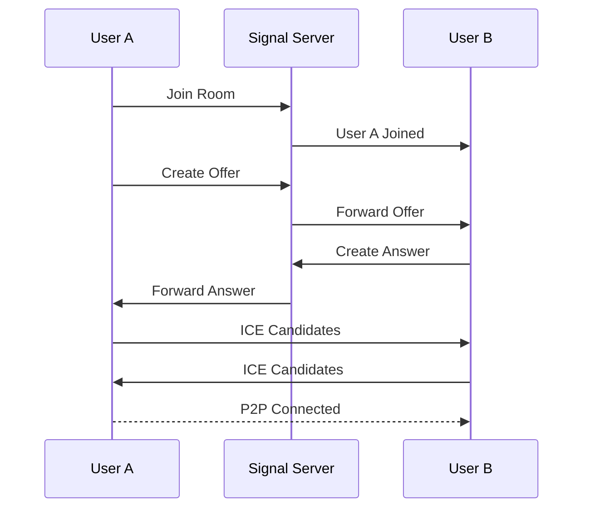

# VideoNet Pro - 코드 상세 분석

이 문서는 VideoNet Pro 프로젝트의 핵심 코드를 분석하고 설명합니다. 각 컴포넌트의 역할과 주요 로직을 다룹니다.

## 📚 목차
1. [백엔드 아키텍처](#백엔드-아키텍처)
2. [프론트엔드 구조](#프론트엔드-구조)
3. [WebRTC 구현](#webrtc-구현)
4. [실시간 통신](#실시간-통신)
5. [인증 시스템](#인증-시스템)

---

## 백엔드 아키텍처

### main.py - FastAPI 메인 서버

#### 핵심 설정 및 초기화
```python
app = FastAPI(title="VideoNet Pro API", version="2.0.0")

# CORS 설정 - 크로스 도메인 요청 허용
app.add_middleware(
    CORSMiddleware,
    allow_origins=["http://localhost:5173", "http://localhost:5174"],
    allow_credentials=True,  # 쿠키 전송 허용
    allow_methods=["*"],
    allow_headers=["*"],
)

# 초대 코드 상수
MASTER_INVITE_CODE = "MASTER2024"
```
- FastAPI 인스턴스를 생성하고 CORS를 설정합니다
- 쿠키 기반 인증을 위해 `allow_credentials=True` 설정이 중요합니다
- 마스터 초대 코드는 최초 가입 시 필요한 특별한 코드입니다

#### 회원가입 엔드포인트 분석
```python
@app.post("/api/auth/register", response_model=AuthResponse)
async def register(user: UserRegister, db: Session = Depends(get_db)):
    # 1. 초대 코드 검증
    if user.inviteCode == MASTER_INVITE_CODE:
        # 마스터 코드로 가입
        pass
    else:
        # 일반 초대 코드 검증
        inviter = db.query(User).filter(
            User.personal_invite_code == user.inviteCode
        ).first()
        if not inviter:
            raise HTTPException(status_code=400, 
                detail="Invalid invitation code")
    
    # 2. 중복 확인
    existing = db.query(User).filter(
        (User.email == user.email) | (User.username == user.username)
    ).first()
    
    # 3. 비밀번호 해싱
    hashed_password = pwd_context.hash(user.password)
    
    # 4. 개인 초대 코드 생성
    personal_code = f"{user.username.upper()}-{random.randint(1000, 9999)}"
```
- 초대 코드 시스템으로 무분별한 가입을 방지합니다
- 비밀번호는 bcrypt로 해싱하여 저장합니다
- 각 사용자는 고유한 개인 초대 코드를 받습니다

#### JWT 토큰 생성
```python
def create_access_token(data: dict):
    to_encode = data.copy()
    expire = datetime.utcnow() + timedelta(minutes=ACCESS_TOKEN_EXPIRE_MINUTES)
    to_encode.update({"exp": expire})
    encoded_jwt = jwt.encode(to_encode, SECRET_KEY, algorithm=ALGORITHM)
    return encoded_jwt
```
- JWT 토큰에 만료 시간을 포함시킵니다
- SECRET_KEY로 서명하여 위조를 방지합니다

#### 방 생성 로직
```python
@app.post("/api/rooms/create")
async def create_room(room_data: RoomCreate, 
                     current_user: User = Depends(get_current_user),
                     db: Session = Depends(get_db)):
    # 1. 고유한 방 ID 생성
    room_id = str(uuid.uuid4())
    
    # 2. 데이터베이스에 방 정보 저장
    new_room = Room(
        id=room_id,
        name=room_data.name,
        description=room_data.description,
        host_id=current_user.id,
        max_participants=room_data.maxParticipants or 10,
        is_private=room_data.isPrivate
    )
    
    # 3. 호스트를 첫 번째 참가자로 추가
    new_room.participants.append(current_user)
```
- UUID를 사용하여 충돌 없는 고유 ID를 생성합니다
- 방 생성자는 자동으로 호스트가 됩니다

### socketio_server.py - 실시간 통신 서버

#### Socket.IO 이벤트 처리
```python
@sio.on('join_room')
async def handle_join_room(sid, data):
    room_id = data.get('roomId')
    user_id = data.get('userId')
    username = data.get('username')
    
    # 1. 세션 저장소에 사용자 정보 저장
    connected_users[sid] = {
        'userId': user_id,
        'username': username,
        'roomId': room_id
    }
    
    # 2. Socket.IO 룸에 참가
    sio.enter_room(sid, room_id)
    
    # 3. 기존 참가자들에게 알림
    await sio.emit('user_joined', {
        'userId': user_id,
        'username': username,
        'socketId': sid
    }, room=room_id, skip_sid=sid)  # 자신을 제외하고 전송
    
    # 4. 새 참가자에게 기존 참가자 목록 전송
    room_users = get_room_users(room_id)
    await sio.emit('room_users', room_users, room=sid)
```
- `sid`는 Socket ID로 각 연결의 고유 식별자입니다
- `skip_sid`를 사용하여 발신자를 제외한 브로드캐스팅이 가능합니다
- 방 참가 시 양방향 통신으로 모든 참가자가 서로를 인식합니다

#### WebRTC 시그널링
```python
@sio.on('webrtc_offer')
async def handle_webrtc_offer(sid, data):
    target_sid = data.get('to')
    offer = data.get('offer')
    
    # 발신자 정보 추가
    user_info = connected_users.get(sid, {})
    
    # 타겟에게만 전송
    await sio.emit('webrtc_offer', {
        'from': sid,
        'offer': offer,
        'username': user_info.get('username')
    }, room=target_sid)
```
- WebRTC는 P2P 연결이므로 서버는 시그널링만 중계합니다
- Offer/Answer 교환으로 연결을 협상합니다

---

## 프론트엔드 구조

### RoomPage.tsx - 화상회의 메인 화면

#### 컴포넌트 상태 관리
```typescript
const RoomPage: React.FC = () => {
  // 미디어 스트림 상태
  const [localStream, setLocalStream] = useState<MediaStream | null>(null);
  const [remoteStreams, setRemoteStreams] = useState<Map<string, MediaStream>>(
    new Map()
  );
  
  // UI 상태
  const [isVideoOn, setIsVideoOn] = useState(true);
  const [isAudioOn, setIsAudioOn] = useState(true);
  const [isScreenSharing, setIsScreenSharing] = useState(false);
  
  // WebRTC 연결 참조
  const connectionsRef = useRef<Map<string, RTCPeerConnection>>(new Map());
  const socketRef = useRef<Socket | null>(null);
```
- `useState`로 React 컴포넌트 상태를 관리합니다
- `useRef`로 렌더링과 무관한 값을 저장합니다 (WebRTC 연결 등)
- Map 자료구조로 여러 참가자의 스트림을 효율적으로 관리합니다

#### 미디어 스트림 획득
```typescript
const setupMediaStream = async () => {
  try {
    const stream = await navigator.mediaDevices.getUserMedia({
      video: {
        width: { ideal: 1280 },
        height: { ideal: 720 },
        facingMode: 'user'  // 전면 카메라
      },
      audio: {
        echoCancellation: true,  // 에코 제거
        noiseSuppression: true,  // 노이즈 제거
        autoGainControl: true    // 자동 음량 조절
      }
    });
    
    setLocalStream(stream);
    
    // 로컬 비디오 요소에 스트림 연결
    if (localVideoRef.current) {
      localVideoRef.current.srcObject = stream;
    }
  } catch (error) {
    console.error('미디어 접근 실패:', error);
    toast.error('카메라/마이크 권한이 필요합니다');
  }
};
```
- `getUserMedia`로 사용자 카메라/마이크에 접근합니다
- 오디오 처리 옵션으로 통화 품질을 향상시킵니다
- 권한 거부 시 적절한 에러 처리가 중요합니다

#### 화면 공유 구현
```typescript
const toggleScreenShare = async () => {
  if (!isScreenSharing) {
    try {
      // 1. 화면 캡처 스트림 획득
      const screenStream = await navigator.mediaDevices.getDisplayMedia({
        video: {
          displaySurface: 'monitor',  // 전체 화면 우선
        } as any,
        audio: false  // 시스템 오디오는 선택적
      });
      
      // 2. 비디오 트랙 교체
      const screenTrack = screenStream.getVideoTracks()[0];
      const videoTrack = localStream?.getVideoTracks()[0];
      
      // 3. 모든 피어 연결에 새 트랙 전송
      connectionsRef.current.forEach((connection) => {
        const sender = connection.getSenders().find(
          s => s.track?.kind === 'video'
        );
        if (sender) {
          sender.replaceTrack(screenTrack);
        }
      });
      
      // 4. 화면 공유 종료 감지
      screenTrack.onended = () => {
        stopScreenShare();
      };
      
      setIsScreenSharing(true);
      setScreenStream(screenStream);
    } catch (error) {
      console.error('화면 공유 실패:', error);
    }
  } else {
    stopScreenShare();
  }
};
```
- `getDisplayMedia`로 화면 캡처 권한을 요청합니다
- `replaceTrack`으로 비디오를 화면 공유로 전환합니다
- 사용자가 브라우저 UI로 공유를 중단할 때를 감지합니다

### webrtc-native.ts - WebRTC 연결 관리

#### 피어 연결 생성
```typescript
export const createPeerConnection = (
  configuration: RTCConfiguration
): RTCPeerConnection => {
  const pc = new RTCPeerConnection({
    iceServers: [
      { urls: 'stun:stun.l.google.com:19302' },  // Google STUN 서버
      { urls: 'stun:stun1.l.google.com:19302' }
    ],
    iceCandidatePoolSize: 10  // ICE 후보 풀 크기
  });
  
  // 연결 상태 모니터링
  pc.onconnectionstatechange = () => {
    console.log('Connection state:', pc.connectionState);
    if (pc.connectionState === 'failed') {
      // 재연결 시도 로직
      pc.restartIce();
    }
  };
  
  return pc;
};
```
- STUN 서버는 NAT 통과를 위한 공인 IP 주소를 알려줍니다
- 연결 상태를 모니터링하여 안정성을 높입니다

#### Offer 생성 및 Answer 처리
```typescript
export const createOffer = async (
  pc: RTCPeerConnection
): Promise<RTCSessionDescriptionInit> => {
  // 1. Offer 생성
  const offer = await pc.createOffer({
    offerToReceiveAudio: true,
    offerToReceiveVideo: true
  });
  
  // 2. 로컬 설명 설정
  await pc.setLocalDescription(offer);
  
  // 3. ICE 수집 완료 대기 (선택적)
  await waitForIceGathering(pc);
  
  return offer;
};

export const handleAnswer = async (
  pc: RTCPeerConnection,
  answer: RTCSessionDescriptionInit
): Promise<void> => {
  // 원격 설명 설정
  await pc.setRemoteDescription(answer);
};
```
- Offer는 연결 시작을 제안하는 SDP 메시지입니다
- Answer는 Offer에 대한 응답입니다
- ICE 수집을 기다리면 연결 성공률이 높아집니다

---

## WebRTC 구현

### P2P 연결 플로우



1. **방 참가**: 사용자가 방에 입장하면 서버가 다른 참가자에게 알립니다
2. **Offer 생성**: 새 참가자가 기존 참가자들에게 연결을 제안합니다
3. **Answer 응답**: 기존 참가자들이 제안을 수락하고 응답합니다
4. **ICE 교환**: NAT 통과를 위한 네트워크 경로 정보를 교환합니다
5. **P2P 연결**: 직접 연결이 수립되어 미디어가 전송됩니다

### ICE (Interactive Connectivity Establishment)

```typescript
// ICE 후보 수집 및 전송
pc.onicecandidate = (event) => {
  if (event.candidate) {
    // 새로운 ICE 후보를 상대방에게 전송
    socket.emit('webrtc_ice_candidate', {
      to: peerId,
      candidate: event.candidate
    });
  }
};

// ICE 후보 수신 및 추가
socket.on('webrtc_ice_candidate', async (data) => {
  const pc = connections.get(data.from);
  if (pc && data.candidate) {
    await pc.addIceCandidate(data.candidate);
  }
});
```
- ICE는 방화벽과 NAT를 통과할 수 있는 최적의 경로를 찾습니다
- 여러 후보(로컬 IP, 공인 IP, 릴레이 서버)를 시도합니다

---

## 실시간 통신

### Socket.IO 연결 관리

```typescript
// 소켓 연결 초기화
const initializeSocket = () => {
  const socket = io('http://localhost:8000', {
    transports: ['websocket'],  // WebSocket 우선 사용
    reconnection: true,         // 자동 재연결
    reconnectionAttempts: 5,    // 재연결 시도 횟수
    reconnectionDelay: 1000,    // 재연결 대기 시간
  });
  
  // 연결 이벤트
  socket.on('connect', () => {
    console.log('Socket connected:', socket.id);
    rejoinRoom();  // 재연결 시 방 재입장
  });
  
  // 연결 끊김 처리
  socket.on('disconnect', (reason) => {
    if (reason === 'io server disconnect') {
      // 서버가 연결을 끊음 - 재인증 필요
      handleReauthentication();
    }
    // 그 외는 자동 재연결 시도
  });
  
  return socket;
};
```
- WebSocket 전송을 우선 사용하여 낮은 지연시간을 보장합니다
- 네트워크 불안정 시 자동 재연결로 사용자 경험을 개선합니다

### 채팅 메시지 처리

```typescript
// 메시지 전송
const sendMessage = (text: string) => {
  const message = {
    id: uuidv4(),
    text,
    userId: user.id,
    username: user.username,
    timestamp: new Date().toISOString()
  };
  
  // 낙관적 업데이트 - 즉시 UI 업데이트
  setMessages(prev => [...prev, message]);
  
  // 서버로 전송
  socket.emit('chat_message', {
    roomId,
    message
  });
};

// 메시지 수신
socket.on('chat_message', (data) => {
  setMessages(prev => {
    // 중복 방지 (낙관적 업데이트와 충돌 방지)
    if (prev.some(m => m.id === data.message.id)) {
      return prev;
    }
    return [...prev, data.message];
  });
  
  // 알림음 재생 (선택적)
  if (data.userId !== user.id) {
    playNotificationSound();
  }
});
```
- 낙관적 업데이트로 즉각적인 반응성을 제공합니다
- 메시지 ID로 중복을 방지합니다

---

## 인증 시스템

### JWT 토큰 관리

```typescript
// API 클라이언트 설정
const apiClient = axios.create({
  baseURL: 'http://localhost:8000/api',
  withCredentials: true,  // 쿠키 자동 전송
});

// 토큰 갱신 인터셉터
apiClient.interceptors.response.use(
  response => response,
  async (error) => {
    const originalRequest = error.config;
    
    if (error.response?.status === 401 && !originalRequest._retry) {
      originalRequest._retry = true;
      
      try {
        // 토큰 갱신 시도
        await apiClient.post('/auth/refresh');
        // 원래 요청 재시도
        return apiClient(originalRequest);
      } catch (refreshError) {
        // 갱신 실패 - 로그인 페이지로
        window.location.href = '/login';
        return Promise.reject(refreshError);
      }
    }
    
    return Promise.reject(error);
  }
);
```
- Axios 인터셉터로 토큰 만료를 자동 처리합니다
- 401 에러 시 토큰 갱신을 시도하고 실패하면 재로그인을 유도합니다

### 보호된 라우트

```typescript
const ProtectedRoute: React.FC<{ children: ReactNode }> = ({ children }) => {
  const { user, loading } = useAuth();
  const location = useLocation();
  
  if (loading) {
    return <LoadingSpinner />;
  }
  
  if (!user) {
    // 로그인 후 원래 페이지로 돌아오기 위해 현재 위치 저장
    return <Navigate to="/login" state={{ from: location }} replace />;
  }
  
  return <>{children}</>;
};
```
- 인증되지 않은 사용자의 접근을 차단합니다
- 로그인 후 원래 요청한 페이지로 리다이렉트합니다

---

## 성능 최적화

### React 최적화

```typescript
// 메모이제이션으로 불필요한 렌더링 방지
const VideoGrid = React.memo(({ streams }) => {
  return (
    <div className="video-grid">
      {Array.from(streams.entries()).map(([userId, stream]) => (
        <VideoTile key={userId} stream={stream} userId={userId} />
      ))}
    </div>
  );
}, (prevProps, nextProps) => {
  // 스트림 개수가 같고 ID가 같으면 리렌더링 하지 않음
  return prevProps.streams.size === nextProps.streams.size &&
    Array.from(prevProps.streams.keys()).every(key => 
      nextProps.streams.has(key)
    );
});
```

### WebRTC 최적화

```typescript
// 적응형 비트레이트
const optimizeVideoQuality = (pc: RTCPeerConnection) => {
  const sender = pc.getSenders().find(s => s.track?.kind === 'video');
  if (sender) {
    const params = sender.getParameters();
    
    // 네트워크 상황에 따라 비트레이트 조정
    params.encodings[0].maxBitrate = 1000000;  // 1Mbps
    params.encodings[0].scaleResolutionDownBy = 2;  // 해상도 1/2
    
    sender.setParameters(params);
  }
};
```

---

## 디버깅 팁

### 개발자 도구 활용

```javascript
// Chrome DevTools에서 WebRTC 통계 확인
chrome://webrtc-internals/

// Socket.IO 디버깅 활성화
localStorage.debug = 'socket.io-client:*';

// React DevTools에서 컴포넌트 상태 확인
// Chrome Extension 설치 필요
```

### 일반적인 문제와 해결법

1. **CORS 에러**
   - 백엔드 CORS 설정 확인
   - 프론트엔드 프록시 설정 확인

2. **WebRTC 연결 실패**
   - STUN/TURN 서버 상태 확인
   - 방화벽 설정 확인
   - chrome://webrtc-internals에서 디버깅

3. **Socket.IO 재연결 문제**
   - 서버 타임아웃 설정 확인
   - 클라이언트 재연결 옵션 조정

---

이 문서는 VideoNet Pro의 핵심 구현을 다루었습니다. 각 섹션의 코드는 실제 프로젝트에서 발췌하여 설명을 추가한 것입니다. 추가 질문이나 더 자세한 설명이 필요한 부분이 있다면 이슈를 생성해주세요.